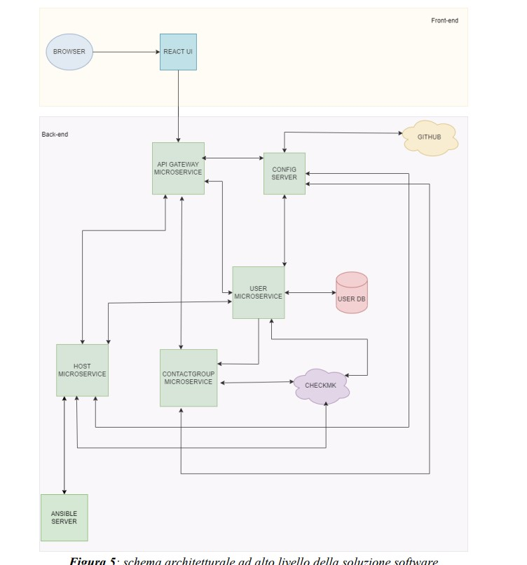
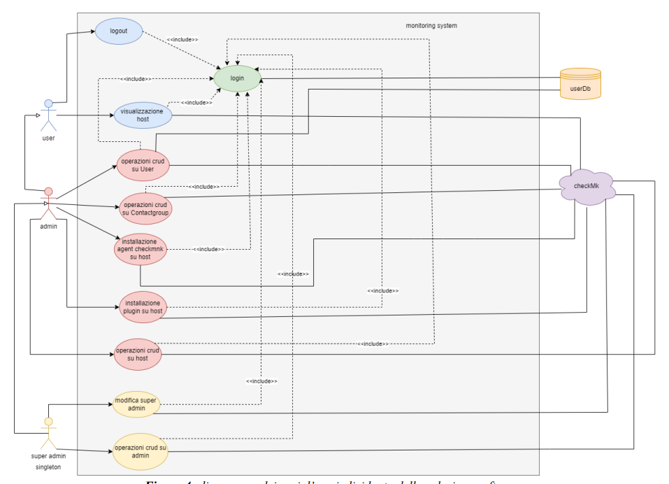

# stage-project

This project was realized during the bachelor degree company internship (duration 3 months)

The application is an exetension of CheckMk basic functionalities.

## architecture

It has a microservice architecture:

- **api gateway microservice**: checks if the JWT token in the request is valid and if the user has the authority to make the request. If yes this micorservice will forward the request to the responsible microservice, otherwise rejects the request

- **contactgroup microservice**:  manage the CRUD operation on contactgroups

- **host microservice**: manage the CRUD operation on hosts and get their status

- **user auth micorservice**: manage the crud operation on users and their registration and authentication

- **configuratin server**: provide some information like CheckMk endpoint url, database password and more to microservices. This information are retrived from a private github repository

## funcitionalities

First of all is necessary to have a working CheckMk site and server and some Vm to monitor. The application permit to add and edit user, add and modify contactgroups, and monitor hosts. Every change made on the application will be also applied on the CheckMk site. In the system there are 3 type of users with different role:

- user: can monitor only the resources that have at least a contactgroup in commin with it 
- admin: can do all user tasks but can also create, modify, delete contactgroups, add delete and modify user and add new admin in the system. They also can install monitoring agents and plugin on the VM
- superadmin: can do all admin tasks but can also modify and delete admin user (superadmin is a singleton)

## languages

- Java (with Springboot framework)
- React (with Redux)

## author 

Cattaneo Alessandro
